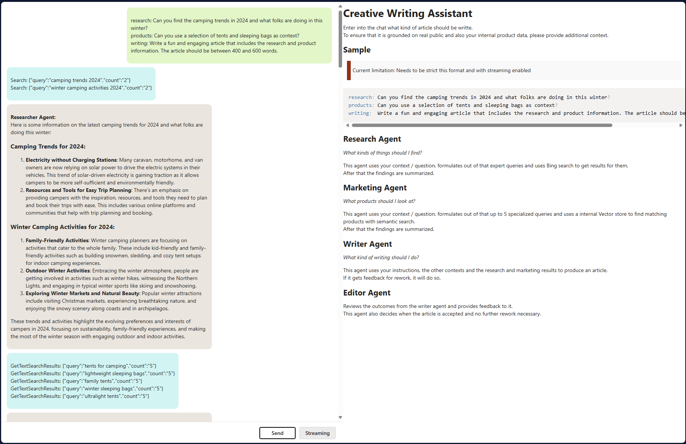
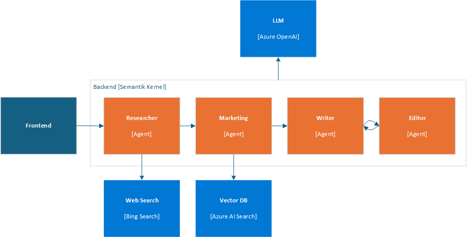
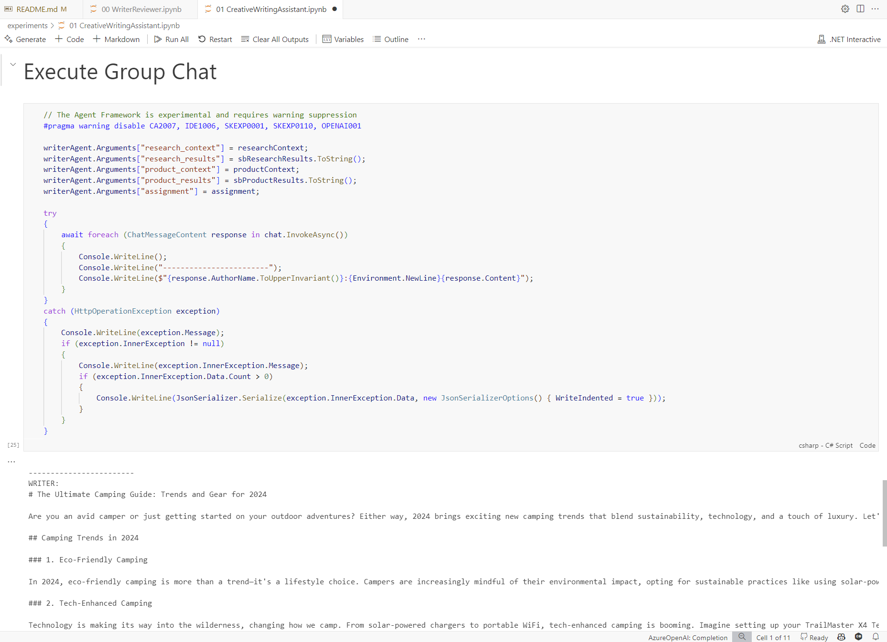
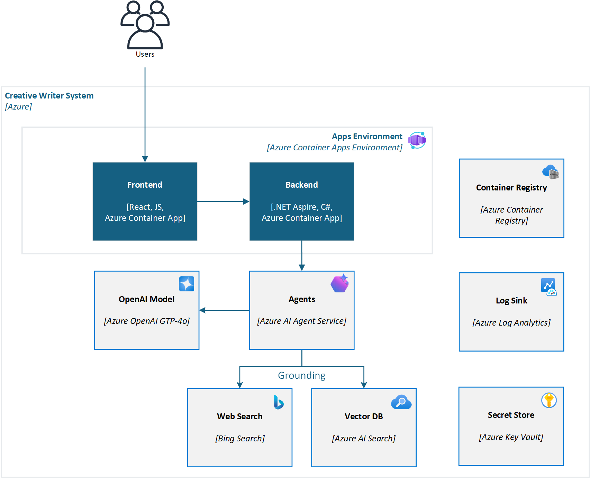

<!--
---
page_type: sample
languages:
- azdeveloper
- bicep
- csharp
- typescript
products:
- ai-services
- azure
- azure-bing-web
- azure-cognitive-search
- azure-container-apps
- azure-openai
- dotnet
- dotnet-aspire
urlFragment: aspire-semantic-kernel-creative-writer
name: "Creative Writing Assistant: Working with Agents using Semantic Kernel and .NET Aspire"
description: "Comprehensive example of a multi-agent chat application built with .NET Aspire, Semantic Kernel, React and Vite, and the `@microsoft/ai-chat-protocol` package."
---
-->

# Creative Writing Assistant: Working with Agents using Semantic Kernel and .NET Aspire (C#)

This project is an alternative to the python version at <https://github.com/Azure-Samples/contoso-creative-writer>.

It is a comprehensive example of a chat application built with .NET Aspire, Semantic Kernel, and the `@microsoft/ai-chat-protocol` package.  
The frontend of the application is developed using React and Vite.

- [Features](#features)
- [Getting Started](#getting-started)
  - [Prerequisites](#prerequisites)
  - [Try it out](#try-it-out)
- [Local Development](#local-development)
  - [Prerequisites](#prerequisites-1)
  - [Running the app](#running-the-app)
- [Azure Deployment](#azure-deployment)
  - [Prerequisites](#prerequisites-2)
  - [Instructions](#instructions)
- [Sample Product Data](#sample-product-data)
- [Guidance](#guidance)
  - [Region Availability](#region-availability)
  - [Costs](#costs)
  - [Security](#security)
- [Resources](#resources)
- [Credits](#credits)
- [Important Security Notice](#important-security-notice)
- [License](#license)

## Features

The application consists of 2 main projects:

- `ChatApp.WebApi`: This is a .NET Web API that handles chat interactions, powered by .NET Aspire and Semantic Kernel. It provides endpoints for the chat frontend to communicate with the chat backend. The `@microsoft/ai-chat-protocol` package is used to handle chat interactions, including streaming and non-streaming requests. For normal chat completion both can be used, to trigger the creative writer only streaming is possible.

- `ChatApp.React`: This is a React app that provides the user interface for the chat application. It is built using Vite, a modern and efficient build tool. It uses the `@microsoft/ai-chat-protocol` package to handle chat interactions, allowing for flexible communication with the chat backend.

The app also includes a class library project, ChatApp.ServiceDefaults, that contains the service defaults used by the service projects.

In addition it has two **.NET Interactive Notebooks** inside the `./experiments/` to show a simple WriterReviewer scenario and also the full version of the CreativeWritingAssistant outside of a real system.





## Getting Started

The first step for getting started with this template are the notebooks which can be used as local experiments.



### Prerequisites

- .NET 9 SDK
- VSCode
  - [Polyglot Notebooks Extension](https://marketplace.visualstudio.com/items?itemName=ms-dotnettools.dotnet-interactive-vscode)
- [Azure Developer CLI (azd)](https://aka.ms/install-azd)

### Try it out

Open the notebooks under `./experiments/` and follow their instructions.

## Local Development

### Prerequisites

- .NET 9 SDK
- VSCode or Visual Studio 2022 17.12
- Node.js 22
- [Azure CLI (az)](https://aka.ms/install-azcli)
- [Azure Developer CLI (azd)](https://aka.ms/install-azd)

### Running the app

If using Visual Studio, open the solution file ChatApp.sln and launch/debug the ChatApp.AppHost project.

If using the .NET CLI, run dotnet run from the ChatApp.AppHost directory.

For more information on local provisioning of Aspire applications, refer to the [Aspire Local Provisioning Guide](https://learn.microsoft.com/en-us/dotnet/aspire/deployment/azure/local-provisioning).

> To utilize Azure resources (e.g. OpenAI) in your local development environment, you need to provide the necessary configuration values.  
> <https://learn.microsoft.com/en-us/dotnet/aspire/azure/local-provisioning#configuration>

Example to add into a *appsettings.Development.json*
``` json
{
  "Azure": {
    "SubscriptionId": "<Your subscription id>",
    "AllowResourceGroupCreation": true,
    "ResourceGroup": "<Valid resource group name>",
    "Location": "swedencentral",
    "CredentialSource": "InteractiveBrowser"
  }
}
```

## Azure Deployment



### Prerequisites

- [Azure CLI (az)](https://aka.ms/install-azcli)
- [Azure Developer CLI (azd)](https://aka.ms/install-azd)
- [Docker Desktop](https://www.docker.com/products/docker-desktop/)

### Instructions

Navigate into `./ChatApp.AppHost/`.

1. Sign in to your Azure account. You'll need to login to both the Azure Developer CLI and Azure CLI:

    i. First with Azure Developer CLI 

    ```shell
    azd auth login
    ```

    ii. Then sign in with Azure CLI 
    
    ```shell
    az login --use-device-code
    ```

2. Provision the resources and deploy the code:

    ```shell
    azd up
    ```

    This project uses `gpt-4o` which may not be available in all Azure regions. Check for [up-to-date region availability](https://learn.microsoft.com/azure/ai-services/openai/concepts/models#standard-deployment-model-availability) and select a region during deployment accordingly.  
    We recommend using *Schweden Central* for this project.

## Sample Product Data

To load sample product data into Azure AI Search as vector store, use the notebook inside `./data/`.

## Guidance

### Region Availability

This template uses `gpt-4o` and `text-embedding-3-large` which may not be available in all Azure regions. Check for [up-to-date region availability](https://learn.microsoft.com/azure/ai-services/openai/concepts/models#standard-deployment-model-availability) and select a region during deployment accordingly

* we recommend using eastus2 or swedencentral

### Costs

You can estimate the cost of this project's architecture with [Azure's pricing calculator](https://azure.microsoft.com/pricing/calculator/)

### Security

This template has [Managed Identity](https://learn.microsoft.com/entra/identity/managed-identities-azure-resources/overview) and Key Vault built in to eliminate the need for developers to manage credentials. Applications can use managed identities to obtain Microsoft Entra tokens without having to manage any credentials. Additionally, we have added a [GitHub Action tool](https://github.com/microsoft/security-devops-action) that scans the infrastructure-as-code files and generates a report containing any detected issues. To ensure best practices in your repo we recommend anyone creating solutions based on our templates ensure that the [Github secret scanning](https://docs.github.com/code-security/secret-scanning/about-secret-scanning) setting is enabled in your repos.

## Resources

- [Semantic Kernel Documentation](https://learn.microsoft.com/en-us/semantic-kernel/overview/)
- [Semantic Kernel Agent Framework Documentation](https://learn.microsoft.com/en-us/semantic-kernel/frameworks/agent/?pivots=programming-language-csharp)
- [Aspire Documentation](https://learn.microsoft.com/en-us/dotnet/aspire/)
- [Chat Protocol Documentation](https://learn.microsoft.com/en-us/dotnet/aspire/ai-chat-protocol/)

## Credits

- Initially based on [Aspire Sample Application](https://github.com/Azure-Samples/aspire-semantic-kernel-basic-chat-app)
- Idea from [Creative Writing Assistant: Working with Agents using Prompty (Python Implementation)](https://github.com/Azure-Samples/contoso-creative-writer)

## Important Security Notice

This template, the application code and configuration it contains, has been built to showcase Microsoft Azure specific services and tools. We strongly advise our customers not to make this code part of their production environments without implementing or enabling additional security features.  

For a more comprehensive list of best practices and security recommendations for Intelligent Applications, [visit our official documentation](https://learn.microsoft.com/en-us/azure/well-architected/ai/application-design).

## License

This project is licensed under the terms of the MIT license. See the `LICENSE.md` file for the full license text.
